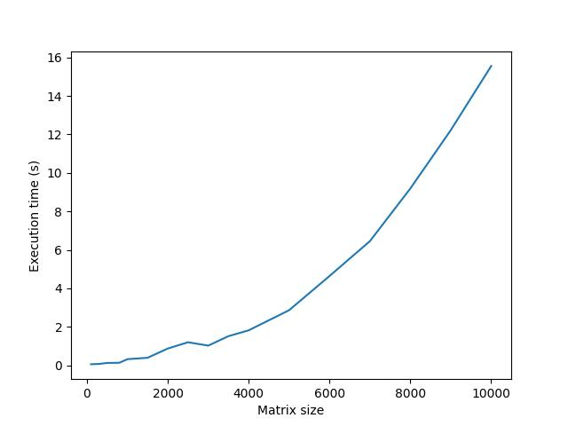

# TP1-multithreading

[](https://results.pre-commit.ci/latest/github/pre-commit/pre-commit/main)

## Description

Le but de ce TP est de faire effectuer une tache sur plusieurs threads en parallèle.
On utilise pour ça un manager de la lib multiprocessing.

## Partie Python

Lancer le manager:

```bash
python3 tp1_multithreading/queueManager.py
```

Lancer un minion qui va effectuer la tache sur un thread:

```bash
python3 tp1_multithreading/minion.py
```

Lancer un boss qui va envoier une tache à effectuer pour les minions:

```bash
python3 tp1_multithreading/boss.py
```

Pour les tests unitaires:

```bash
python3 tp1_multithreading/test_task.py
```

## Partie C++

### Compilation

Pour configurer le projet:

```bash
cmake -B build -S .
```

Pour compiler le projet:

```bash
cmake --build build
```

### Utilisation

Pour lancer le proxy python:

```bash
python3 tp1_multithreading/proxy.py
```

Pour lancer le client C++:

```bash
./build/low_level
```

## Évaluation

### Programme d'évaluation

Le programme benchmark.py permet de tester une "configuration", c'est à dire un certains nombre de minion py ou c++ avec un certain parametrage.

```bash
python3 tp1_multithreading/benchmark.py
```

| Type de minion        | Temps d'execution |
| --------------------- | ----------------- |
| Python                |        |
| C++  Debug 1 Thread   |  |
| C++  Release          |  |
| C++  Release + O3     |       |
